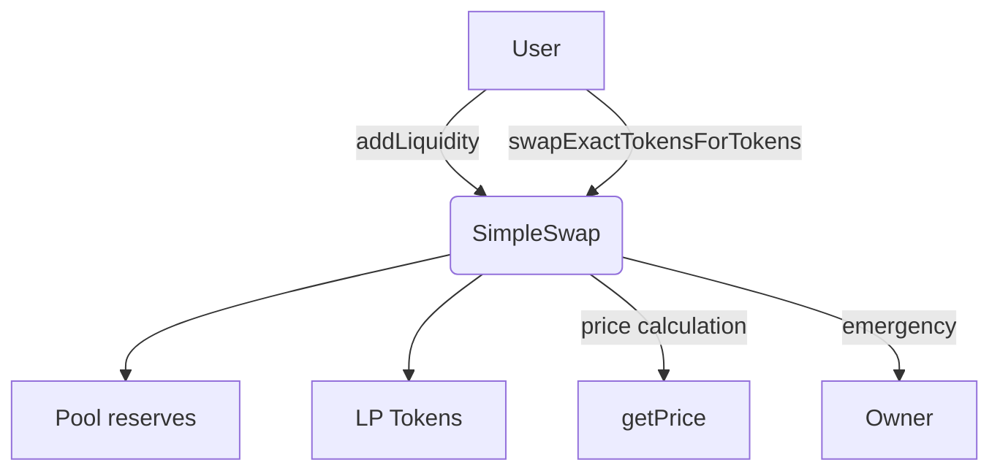

# 🦄 SimpleSwap - Uniswap V2 Style Decentralized Exchange

[](https://opensource.org/licenses/MIT)
[](https://soliditylang.org)
[](https://openzeppelin.com/contracts/)

**SimpleSwap** is a secure, gas-optimized, and production-grade Automated Market Maker (AMM) protocol based on the Uniswap V2 constant product formula. It allows decentralized token swaps, liquidity provision, and LP token issuance with full support for emergency controls and safe operations.

---

## 📑 Table of Contents

- [Features](#-features)

- [Architecture](#-architecture)

- [Getting Started](#-getting-started)

- [Usage](#-usage)

- [Local Development with Remix](#-local-development-with-remix)

- [Core Functions](#-core-functions)

- [Events](#-events)

- [Security](#-security)

- [Testing](#-testing)

- [Deployment Info](#-deployment-info)

- [Function Interface](#-function-interface)

- [FAQ](#-faq)

- [License](#-license)

---

## 🌟 Features

- 🧮 Constant Product Formula (`x * y = k`)
- 💧 Proportional LP token minting using minimum-ratio logic
- 🔄 Token swaps with output estimation via `getAmountOut`
- 📈 Real-time price oracle via reserve ratio (`getPrice`)
- 🛠️ Pausing, unpausing, and emergency withdrawals
- 🧠 Gas-efficient code with custom error types
- 🔍 Full input validation and deadline enforcement
- 📘 Fully documented using NatSpec
- 🧩 Validations consolidadas y modularizadas para eficiencia

---

## 📐 Architecture



---

## 🚀 Getting Started

### Prerequisites

- Node.js (v16+)
- npm or yarn
- Hardhat or Truffle

### Installation

```bash
npm install @openzeppelin/contracts
```

### Compilation

```bash
npx hardhat compile
```

### Token Contracts

This project requires two ERC-20 tokens:

- **TokenA**: Name = `TokenA`, Symbol = `TKA`
- **TokenB**: Name = `TokenB`, Symbol = `TKB`

Each with a fixed supply, deployed before initializing `SimpleSwap`.

---

## 💻 Usage

### Deployment Steps

1. Deploy TokenA and TokenB
2. Deploy `SimpleSwap.sol`
3. Call `approve()` on both tokens to allow SimpleSwap to move them
4. Use `addLiquidity()` to initialize the pool
5. Call `swapExactTokensForTokens()` to trade tokens

---

### Adding Liquidity (Example)

```javascript
await tokenA.approve(simpleSwap.address, ethers.utils.parseEther("100"));
await tokenB.approve(simpleSwap.address, ethers.utils.parseEther("100"));

const deadline = Math.floor(Date.now() / 1000) + 300;

await simpleSwap.addLiquidity(
  tokenA.address,
  tokenB.address,
  ethers.utils.parseEther("100"),
  ethers.utils.parseEther("100"),
  0,
  0,
  owner.address,
  deadline
);
```

---

## 🧪 Local Development with Remix

### Steps:

1. Open [Remix IDE](https://remix.ethereum.org)

2. Create:

   - `SimpleSwap.sol`
   - `TokenA.sol`
   - `TokenB.sol`
   - `ISimpleSwap.sol`

3. Paste the source code into each

4. Compile using Solidity `^0.8.0`

5. Deploy tokens, then `SimpleSwap`

6. Approve token transfers to the DEX

7. Call:

   - `addLiquidity()`
   - `swapExactTokensForTokens()`
   - `removeLiquidity()`

8. Admin:

   - `pause()`, `unpause()`, `emergencyWithdraw()`

9. Read functions:

   - `getPrice()`, `getAmountOut()`, `getReserves()`

---

## ⚙️ Core Functions

### Liquidity

| Function            | Purpose                                  |
| ------------------- | ---------------------------------------- |
| `addLiquidity()`    | Deposit token pair and receive LP tokens |
| `removeLiquidity()` | Burn LP tokens and withdraw pool tokens  |

### Swapping

| Function                     | Purpose                                             |
| ---------------------------- | --------------------------------------------------- |
| `swapExactTokensForTokens()` | Execute token-to-token swaps                        |
| `getAmountOut()`             | Estimate output for swap (constant product formula) |

### Price & Reserves

| Function        | Purpose                                |
| --------------- | -------------------------------------- |
| `getPrice()`    | Fetch current price (tokenA in tokenB) |
| `getReserves()` | View current reserves for token pair   |

### Admin Controls

| Function                | Purpose                                      |
| ----------------------- | -------------------------------------------- |
| `pause()` / `unpause()` | Stop or resume all operations                |
| `emergencyWithdraw()`   | Withdraw tokens during emergency when paused |

---

## 📡 Events

_Refer to the Solidity contract for detailed event signatures._

- `LiquidityAdded`
- `LiquidityRemoved`
- `Swap`
- `EmergencyWithdraw`

---

## 🔒 Security

### Built-in Protections

- ✅ ReentrancyGuard
- ✅ Pausable pattern
- ✅ Deadline checks
- ✅ Custom error validation
- ✅ Reserve sorting and storage consistency
- ✅ Consolidated internal validations

### Tips

- Always check slippage limits
- Use `getAmountOut()` to simulate swaps
- Use `getReserves()` before adding/removing liquidity

---

## 🧪 Testing

### Suggested Tests

```bash
npx hardhat test
```

- ✅ Add/remove liquidity
- ✅ Swap execution and output estimation
- ✅ LP token mint/burn logic
- ✅ Pause/unpause and emergency recovery
- ✅ Failure cases (zero input, deadline passed, etc.)

---

## 📍 Deployment Info

| Network | Contract Address                             |
| ------- | -------------------------------------------- |
| Sepolia | `0xC12806C775B5898EC3306d5Da2C216f1dCf2a4d2` |

_Replace with your local/testnet deployment as needed._

---

## 🔌 Function Interface

### Internal Helper Functions

```solidity
function _validateTokensAndRecipient(
    address tokenA,
    address tokenB,
    address to
) internal pure;


function _checkMinAmount(
    uint256 amount,
    uint256 minAmount,
    string memory tokenName
) internal pure;
```

### All public/external functions exposed by the interface:

```solidity
function addLiquidity(address tokenA, address tokenB, uint amountADesired, uint amountBDesired, uint amountAMin, uint amountBMin, address to, uint deadline) external returns (uint amountA, uint amountB, uint liquidity);

function removeLiquidity(address tokenA, address tokenB, uint liquidity, uint amountAMin, uint amountBMin, address to, uint deadline) external returns (uint amountA, uint amountB);

function swapExactTokensForTokens(uint amountIn, uint amountOutMin, address[] calldata path, address to, uint deadline) external returns (uint[] memory amounts);

function getAmountOut(uint amountIn, uint reserveIn, uint reserveOut) external pure returns (uint amountOut);

function getPrice(address tokenA, address tokenB) external view returns (uint price);

function getReserves(address tokenA, address tokenB) external view returns (uint reserveA, uint reserveB);

function pause() external;
function unpause() external;
function emergencyWithdraw(address token, address to, uint amount) external;
```

---

## ❓ FAQ

_Refer to in-code NatSpec for further behavior explanations._

### How are LP tokens calculated?

- For new pools: `sqrt(amountA * amountB)`
- For existing pools: `min((amountA * totalSupply) / reserveA, (amountB * totalSupply) / reserveB)`

### Are tokens ordered internally?

Yes. All token pairs are stored with sorted addresses to ensure uniqueness and data consistency.

### What happens if I pass tokens in reverse order?

Internally, tokens are sorted so the behavior is consistent regardless of input order.

### Are there swap fees?

This version does **not** include a fee mechanism. It can be extended in `_getAmountOut()`.

---

## 📄 License

MIT License. See [LICENSE](LICENSE) for full details.

---

> 📌 **Note**: For production use, thorough testing and auditing is recommended. The contract is designed for educational purposes and may need modifications for production environments.

> 🔗 **Verified Contract**:

- [View on Sepolia Etherscan](https://sepolia.etherscan.io/address/0xC12806C775B5898EC3306d5Da2C216f1dCf2a4d2#code)
- [View on Sepolia Sourcify](https://repo.sourcify.dev/11155111/0xC12806C775B5898EC3306d5Da2C216f1dCf2a4d2)
- [View on Sepolia Blockscout](https://eth-sepolia.blockscout.com/address/0xC12806C775B5898EC3306d5Da2C216f1dCf2a4d2?tab=contract)
- [View on Sepolia Routescan](https://testnet.routescan.io/address/0xC12806C775B5898EC3306d5Da2C216f1dCf2a4d2/contract/11155111/code)

---
